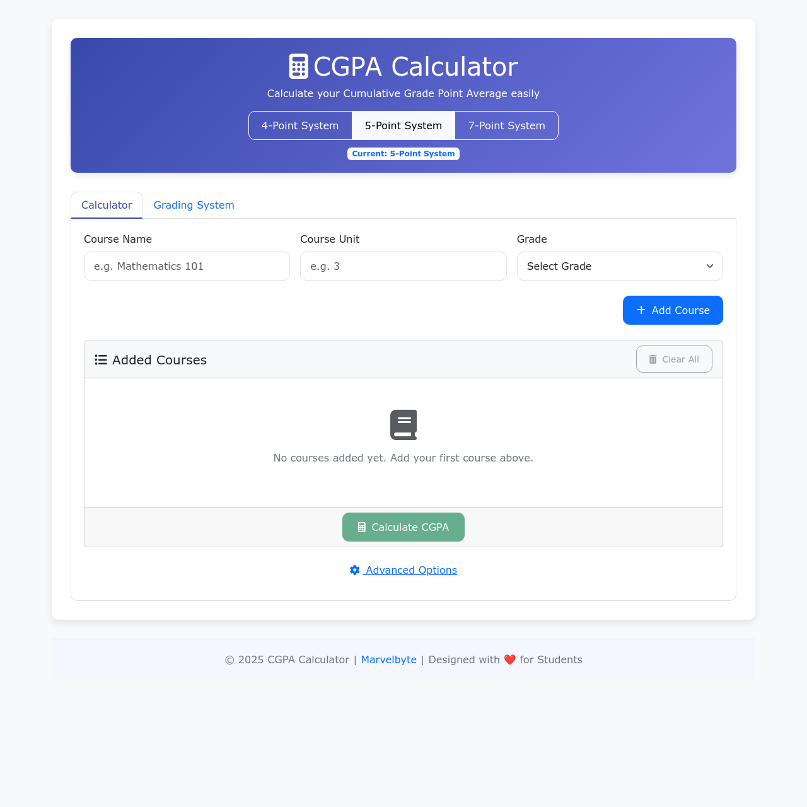

# CGPA Calculator



A responsive web application for calculating Cumulative Grade Point Average (CGPA) with support for multiple grading systems (4-point, 5-point, and 7-point scales).

[](https://marve-cgpa.vercel.app/) [](LICENSE)

## Features

- 🎓 Supports three grading systems:
  - 4-Point Scale (Common in many universities)
  - 5-Point Scale (Standard Nigerian system)
  - 7-Point Scale (Used in some international institutions)
- 📊 Calculate both current semester GPA and cumulative CGPA
- ➕ Add multiple courses with units and grades
- 🔄 Switch between grading systems seamlessly
- 📱 Fully responsive design works on all devices
- 📖 Detailed grading system explanations
- ⚙️ Advanced options to include previous CGPA

## How to Use

1. Select your grading system (4-point, 5-point, or 7-point)
2. Add your courses with:
   - Course name
   - Credit units
   - Grade obtained
3. Optionally include previous CGPA in advanced options
4. Click "Calculate CGPA" to see your results

## Installation

To run locally:

```bash
git clone https://github.com/meetmarvelous/cgpa_calculator.git
cd cgpa_calculator
```

Open `index.html` in your browser.

## Technologies Used

- HTML5
- CSS3 (with custom variables)
- JavaScript (ES6)
- Bootstrap 5
- Font Awesome

## Contributing

Contributions are welcome! Please open an issue or submit a pull request.

1. Fork the project
2. Create your feature branch (`git checkout -b feature/AmazingFeature`)
3. Commit your changes (`git commit -m 'Add some AmazingFeature'`)
4. Push to the branch (`git push origin feature/AmazingFeature`)
5. Open a pull request

## License

Distributed under the MIT License. See `LICENSE` for more information.

## Connect with Me

- Portfolio: [marvelbyte.vercel.app](https://marvelbyte.vercel.app)
- GitHub: [@meetmarvelous](https://github.com/meetmarvelous)

## Acknowledgements

- [Bootstrap](https://getbootstrap.com)
- [Font Awesome](https://fontawesome.com)
- All contributors and users

---

⭐️ From [Marvelous Adegbiji](https://github.com/meetmarvelous)
